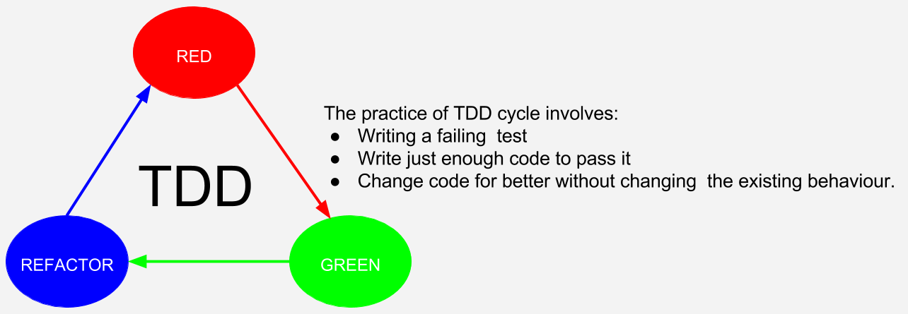

## Test-Driven development 

I'm writing this post to summarize what I'm learning about TDD

Test-driven development or TDD is a style of programming which refer to the practice of writing units test before writing code.

For the first time the test should fail, and after failing you write simple code to make the code pass, and refactor it to make 
it works as you want.

Developers know the cycle as _red, green, refractor_.

As said by __Rudyard Kipling__ following the story [*__"Elephant's Child"__* in *__" Just So Stories"__*](http://members.optusnet.com.au/charles57/Creative/Techniques/elephants_child.htm)

> I keep six honest serving-men
> (They taught me all I knew);
> Their names are *What* and *Why* and *When*
> And *How* and *Where* and *Who*.

So every time We are studying something new, We should always answer those 6 questions.

So let Go

## Who 

### Who create TDD?

Every time you are reading about TDD, you should come across this name : *Kent Beck*

Here is what is said in [his wikipedia](https://en.wikipedia.org/wiki/Kent_Beck):

> Kent Beck (born 1961) is an American software engineer and the creator of extreme programming,
> a software development methodology that eschews rigid formal specification for a collaborative and iterative design process.
> Beck was one of the 17 original signatories of the Agile Manifesto,
> the founding document for agile software development. 
> *__Extreme and Agile methods are closely associated with Test-Driven Development (TDD)__*, 
> of which Beck is perhaps the leading proponent.

### Who use TDD?

Every software engineer of any level should use TDD 

#### Beginner

should be able to write a unit test prior to writing the corresponding code
and be able to write code sufficient to make a failing test pass
#### Intermediate

Should be able practices "test-driven bug fixing": 
when a defect is found, writes a test exposing the defect before correction
I think as an intermediate Software engineer I *should* learn this and start applying this every time I'm maintaining a code

[Source](https://www.agilealliance.org/glossary/tdd/#q=~(filters~(postType~(~'page~'post~'aa_book~'aa_event_session~'aa_experience_report~'aa_glossary~'aa_research_paper~'aa_video)~tags~(~'tdd))~searchTerm~'~sort~false~sortDirection~'asc~page~1))

## Why?

let answer this question : 

#### *Is unit testing or test-driven development worthwhile?*

Let grabs some ideas from those answers to that question on [stackexchange](https://softwareengineering.stackexchange.com/questions/140156/is-unit-testing-or-test-driven-development-worthwhile) 

Even if it takes time and effort and it is not easy  test-driven development worth it because:

- It act as a kind of watchdog for future changes that you or someone else might make. 
Test breakage will result when someone changes the code in undesirable ways.
It helps you to check if changes you made to your code doesn't create bugs in production especially.
-  Unit testing has value as a crutch. 
It supports your development efforts, 
allowing you to change your implementation without fearing that your application will cease to work as required.
Unit tests are also much more than a crutch,
as they give you a tool with which you can validate that your implementation matches the requirements.

(Sometimes when writing a code, or updating it we are always asking yourself will this work as expected? most times we 
are afraid to change our code because we are afraid to break it.)

-  For a developer to prove that his code is working better to write a test and pass it than shouting,
singing or dancing about it.

## When should we write tests?

From a TDD preceptive we should write tests before writing the code.
We have just learned that it is a best practice to write units test before fixing a bug especially when we are maintaining code.

## How should we write unit tests?

Every decent programing language has a unit test framework.
for python, we have unittest , pytest and flasktest just to name some.
